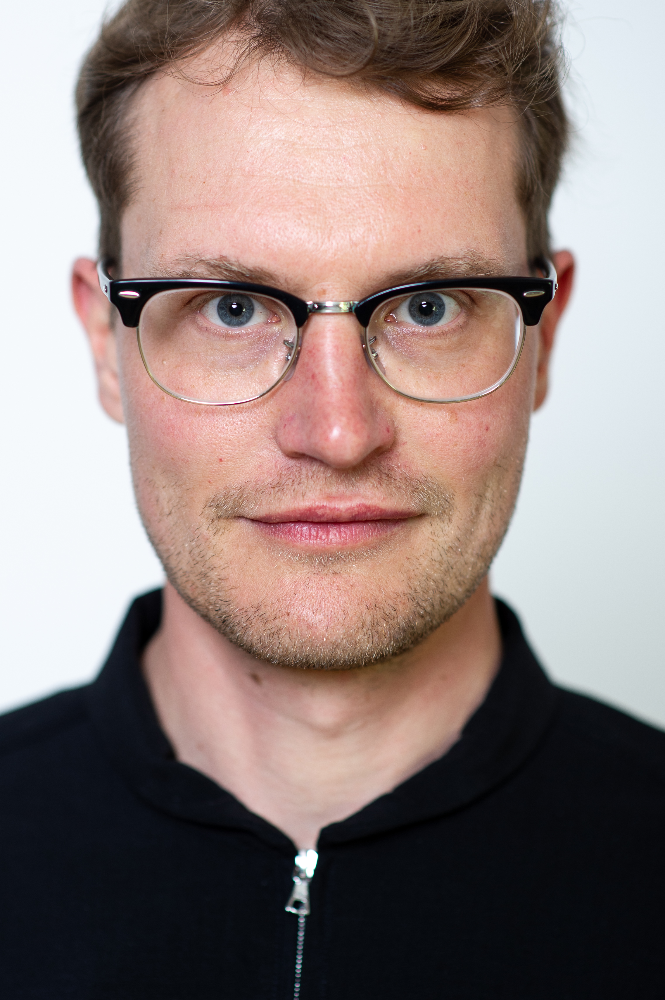

I am Assistant Professor at the Department of Sociology at Utrecht University (the Netherlands).

I obtained my PhD in social sciences ('summa cum laude') in 2017 from the University of Bamberg, Germany. Afterwards, I held positions as project coordinator (Humboldt-University of Berlin), project leader (Leipzig University), and research group leader (University of Potsdam). 

My research examines how contemporary societal transformations—particularly migration, increasing diversity, demographic change, and digitalization—reshape social relationships and what consequences this has for integration, social cohesion, and social inequality. Situated at the intersection of sociology, social stratification research, and the sociology of education, my work focuses on four interconnected areas: multidimensional social structure, migration and integration, educational inequality, and the digital transformation of social relationships.

My research combines social-structural, network-theoretical, and analytical-sociological perspectives and pursues an explicitly interdisciplinary approach that integrates sociology with psychology, educational science, and computational social science. Methodologically, I develop theoretical and quantitative approaches to studying complex social structures, including the concept of multidimensional heterogeneity, and apply large-scale surveys, longitudinal social network analysis, computational methods, and mixed-methods designs to investigate the mechanisms linking social structure, social relationships, and social inequality.

Feel free to contact me at: g.lorenz@uu.nl

[Curriculum Vitae (PDF)](_includes/Georg_Lorenz_CV_2026-06_en_website.pdf)
