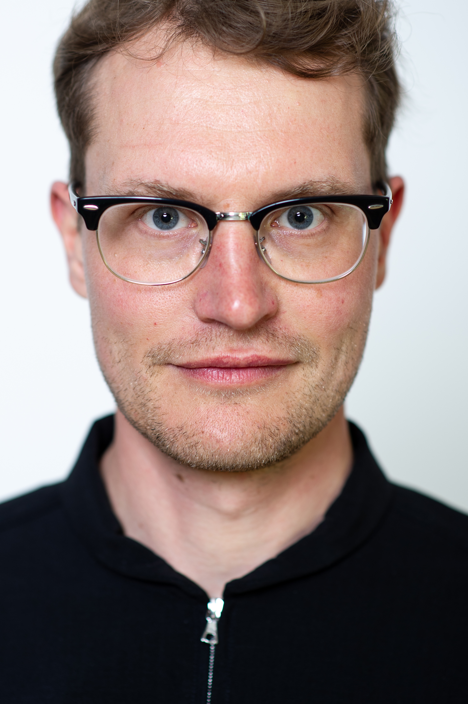

  <aside class="profile-sidebar">
    
    
Georg Lorenz

    
Assistant Professor Utrecht University

    

      <a href="https://scholar.google.com/citations?user=C9KEwL4AAAAJ">Google Scholar</a>
      <a href="https://bsky.app/profile/glorenz.bsky.social">Bluesky</a>
      <a href="mailto:g.lorenz@uu.nl">Email</a>
    

    

      

        
{{ site.data.scholar.citations_all }}

        
Citations

        
{{ site.data.scholar.citations_recent }} since {{ site.data.scholar.since_year }}

      

      

        
{{ site.data.scholar.hindex_all }}

        
h-index

        
{{ site.data.scholar.hindex_recent }} since {{ site.data.scholar.since_year }}

      

      

        
{{ site.data.scholar.i10index_all }}

        
i10-index

        
{{ site.data.scholar.i10index_recent }} since {{ site.data.scholar.since_year }}

      

    

    

      
    

    
Source: <a href="{{ site.data.scholar.profile_url }}">Google Scholar</a> updated daily &middot; {{ site.data.scholar.last_updated }}

  </aside>

  

I am **Assistant Professor** at the <a href="https://www.uu.nl/en/organisation/sociology" style="color:#1a5fb4; font-weight:bold;">Department of Sociology</a> at Utrecht University (the Netherlands).

I obtained my PhD in social sciences ('summa cum laude') in 2017 from the University of Bamberg, Germany. Afterwards, I held positions as project coordinator (Humboldt-University of Berlin), project leader (Leipzig University), and research group leader (University of Potsdam).

My [research](research.html) examines how **societal transformations** like migration, increasing diversity, demographic change, and digitalization affect **social relationships** and what consequences this has for **integration, social cohesion,** and **social inequality.** Current work focuses on **interethnic friendships** and social integration, the effects of **social networks** on **educational inequality**, stereotypes and subtle **discrimination**, and the **digital transformation of social relationships**.

A current project, funded by the Dutch Research Council, investigates social cohesion in ethnically diverse schools as part of [SOCION](https://socion-program.org/project/rethinking-social-cohesion-in-ethnically-diverse-schools-linking-horizontal-and-vertical-ties/).

My research combines analytical-sociological perspectives and pursues an **interdisciplinary** approach that integrates sociology with (social-)psychology, and educational, and organizational science. Methodologically, I develop **theoretical** and **quantitative and computational approaches** to studying complex social structures, including the concept of **multidimensional heterogeneity**. These methods include large-scale surveys, longitudinal social network analysis, computational methods, and mixed-methods designs.

My [teaching](activities.html#teaching) covers introductory and advanced courses on sociology and social network analysis, including lectures on social networks and educational inequality at Utrecht University, seminars on social network analysis at Leipzig University, and tutorials on discrimination, immigration, and educational inequality at the University of Bamberg.

[Curriculum Vitae (PDF)](assets/Georg_Lorenz_CV_2026-07_en_website.pdf)

  

